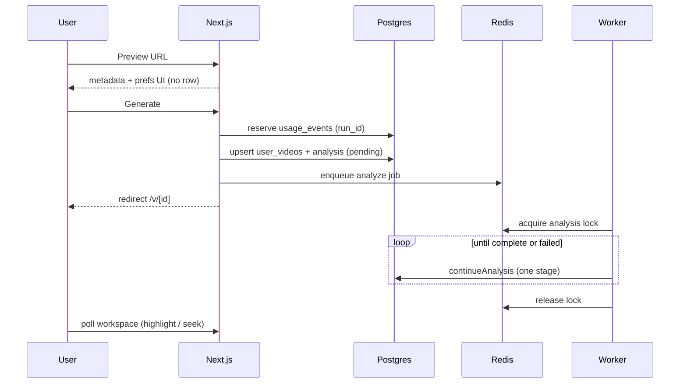

# Analysis pipeline

Core loop: **Preview** (metadata only) → **Generate** (persist + reserve usage + enqueue) → **worker** (fetch → generate) → **workspace** (highlight + seek while the job finishes).

## Preview vs Generate

| Step | DB | Usage | Queue |
|------|----|-------|-------|
| Preview URL | none | no | no |
| Generate | upsert `user_videos` + analysis | yes (`usage_events`) | enqueue `analyze` |

Preview is ephemeral. Abandoning a preview leaves nothing to delete. Generate creates the library row, writes prefs + a new `run_id`, reserves a usage slot, enqueues, and redirects to `/v/[userVideoId]`.

Re-Generate on the same URL always **resets**: new `run_id`, clear prior summary/sections, refresh transcript from YouTube. A prior in-flight slot for that video is refunded when replaced.

## End-to-end flow



## State machine

```text
pending → fetching → generating → complete
                                ↘ failed
```

There is no classify stage. UI shows progress without exposing Redis, BullMQ, or `runId`.

## Worker: one stage per tick

`processAnalyzeJob` acquires a Redis lock for `(userVideoId, runId)`, then repeatedly calls `continueAnalysis` until the analysis is terminal or the run no longer matches.

- **Lock busy** → job delayed and retried (another worker may own the video).
- **Heartbeat** renews the lock TTL while stages run.
- **`run_id` CAS** on Postgres writes drops stale work if a newer Generate won.

`continueAnalysis` advances **exactly one** stage per call:

1. **fetching** — English captions via `TranscriptProvider` (`youtubei.js`); persist segments on `user_videos`.
2. **generating** — transcript subset + prefs → `AIProvider.generateSections` → Zod-validate → persist overview `summary` + `sections[]`.

Output shape:

```text
{ summary, sections: { title, startTime, endTime, body }[] }
```

Prefs on the analysis row: length and tone (0–100); familiarity only when the YouTube category qualifies (Education, Howto & Style, Science & Technology, News & Politics).

## Usage around Generate

Reserve happens **before** ingest/enqueue. Failures after reserve refund the same `run_id` (duration check, ingest error, enqueue failure). Quotas are daily per user and tier, plus global hourly/daily and optional IP limits — all in Postgres, not Redis. Full limits and Stripe plan wiring: [billing-usage.md](billing-usage.md).

## Code entry points

| Step | File |
|------|------|
| Preview / Generate actions | `src/lib/actions/library.ts` |
| Ingest + analysis row reset | `src/domain/ingest/ingest-youtube-video.ts` |
| Stage machine | `src/domain/analysis/continue-analysis.ts` |
| Job processor + lock | `src/lib/queue/process-analyze-job.ts` |
| Lock primitives | `src/lib/queue/analysis-lock.ts` |
| Worker process | `src/worker/index.ts` |
| Structured LLM schema | `src/domain/analysis/schemas.ts` |
